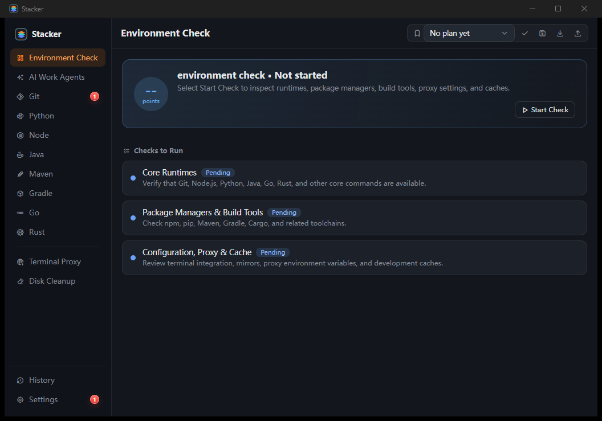
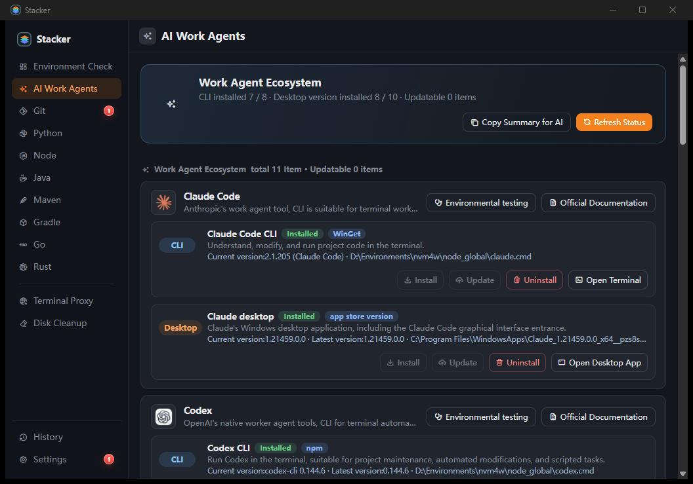
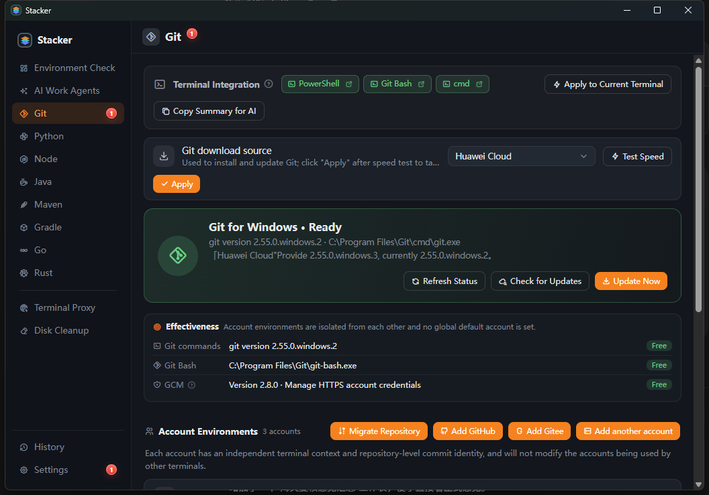
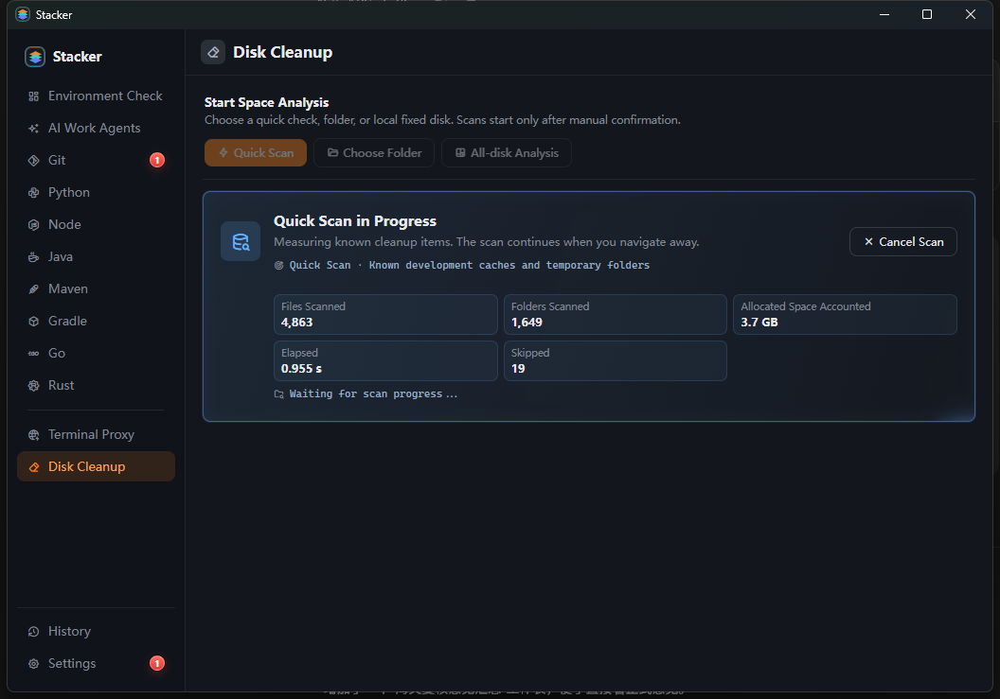

# Stacker

**面向 AI 辅助开发的 Windows 工作站管理器**

让工作智能体专注代码，让本机环境保持可见、可控、可恢复。

Stacker 将开发运行时、构建工具、AI 工作智能体、Git 多账号、下载源、终端代理和开发磁盘治理集中到一个原生 Windows 应用中。它不替代 Codex、Claude Code 或 IDE，而是管理这些工具真正依赖的本机开发基础设施。

[简体中文](#简体中文) · [English](#english)

[](https://github.com/byteswalk/stacker/releases/latest)
[](#系统要求)
[](LICENSE)
[](https://tauri.app/)

## 简体中文

### 为什么需要 Stacker

AI 编程正在把开发速度推到新的水平，但它也会更频繁地调用本机运行时、包管理器、构建工具和浏览器缓存。随着项目和智能体增多，版本冲突、失效 PATH、重复下载、缓存膨胀和磁盘占满会逐渐变成工作站问题。

Stacker 解决的是这一层：

- **看得清**：按需体检 Git、Python、Node.js、Java、Maven、Gradle、Go、Rust 和包管理器的真实生效状态。
- **管得住**：安装、发现、切换和删除运行时版本，统一终端验证与环境摘要。
- **交得给 AI**：生成不含密钥的本机生态摘要和 Git 账号上下文，供工作智能体直接使用。
- **收得回空间**：定位开发产物、缓存、大文件和历史快照，并在删除前重新验证目标。
- **改得可恢复**：关键配置写入前自动备份，支持查看差异和恢复。

### 核心体验

#### 生态环境体检

一次检查本机核心开发生态，结果聚焦实际生效的命令、运行时和构建工具。体检由用户主动启动，切换页面不会中断后台任务。



#### AI 工作智能体

集中查看 Claude Code、Codex、Antigravity、OpenCode、ZCode、Kimi Code、WorkBuddy、Qoder、TRAE Work、OpenClaw 和 Hermes Agent 的 CLI 与桌面端状态。支持按单项检测，在官方提供稳定安装方式时执行安装、更新、卸载和启动。



#### Git 多账号执行环境

管理 GitHub、Gitee、GitLab、Gitea、Forgejo、GitHub Enterprise、阿里云云效 Codeup 和通用 HTTPS Git 服务账号。每个账号拥有独立的终端上下文与仓库级提交身份，不修改其他终端正在使用的账号。

访问令牌保存在 Windows 凭据管理器中，不写入项目文件，也不会出现在复制给 AI 的摘要中。



#### 开发空间分析

快速扫描常见开发缓存，或选择多个目录和本地固定磁盘进行深度分析。扫描在后台持续运行，可在页面间切换，并实时展示文件数、目录数、已统计空间、跳过数量和耗时。

深度结果支持目录下钻、大文件查看、项目识别和分类筛选。清理流程先生成计划，执行前再次验证路径、文件身份、项目标记和软链接边界；系统保护目录可按需使用 UAC 提权扫描。



### 支持的开发生态

| 生态 | 管理能力 |
| --- | --- |
| Git | Git for Windows 检测、安装与更新，多平台账号上下文、工程初始化和仓库迁移 |
| Python | pyenv-win、运行时安装与发现、默认版本、pip 镜像、终端集成 |
| Node.js | fnm、运行时安装与发现、npm/pnpm/yarn 镜像、大文件下载镜像 |
| Java | JDK 扫描与安装、默认运行时、用户级或系统级 `JAVA_HOME` 与 `PATH` |
| Maven | 版本发现与安装、默认版本、仓库镜像、代理与 `settings.xml` |
| Gradle | 版本发现与安装、Wrapper 下载源、仓库镜像与初始化脚本 |
| Go | SDK 发现与安装、默认版本、用户级或系统级 `GOROOT` / `GOPROXY` |
| Rust | rustup 工具链、stable/beta/nightly、组件、targets 与 Cargo 源 |

每个生态页统一提供状态刷新、磁盘扫描、版本安装、默认版本切换、终端验证和“复制摘要给 AI”。删除操作均要求二次确认；删除当前默认版本时会同步处理相关环境配置。

### 下载源与网络

- 按运行时下载、包仓库、构建工具和大文件下载场景维护源目录。
- 支持延迟测试、连接超时、手动应用、清除、自定义源、导入与导出。
- 可从远程清单更新内置公共源，本地自定义源独立保留。
- 统一管理终端代理与 `NO_PROXY`，并为已打开终端生成临时生效命令。
- 后台按用户设置检查程序版本、公共源清单和生态版本更新。

### 安全边界

- Stacker 不上传项目内容、本机环境信息或 Git 访问令牌。
- Git 令牌仅保存在 Windows 凭据管理器中。
- 系统级环境修改和受保护目录扫描需要明确的 Windows UAC 授权。
- 磁盘清理仅处理经过分类和重新验证的目标；无法确认的内容只展示，不自动删除。
- 关键配置修改前创建本地备份，可在“历史”页面查看和恢复。
- Release 提供 SHA-256 校验清单。

### 下载

从 [GitHub Releases](https://github.com/byteswalk/stacker/releases/latest) 获取最新版本：

- **安装版**：适合日常使用，提供开始菜单与卸载入口。
- **免安装版**：解压后运行 `Stacker.exe`，适合临时使用和便携工具盘。
- **校验文件**：使用 `SHA256SUMS.txt` 验证下载产物。

### 快速开始

1. 启动 Stacker，在“生态环境体检”中执行首次检查。
2. 进入对应生态页，发现或安装运行时并设置默认版本。
3. 对下载源和包仓库测速，确认后点击“应用”。
4. 在“AI 工作智能体”中刷新已安装工具，按需复制环境摘要。
5. 使用“磁盘清理”快速扫描缓存，或选择目录进行深度空间分析。
6. 需要撤销配置变更时，在“历史”页面检查备份并恢复。

### 系统要求

- Windows 10 或 Windows 11，64 位。
- Microsoft Edge WebView2 Runtime，现代 Windows 10/11 通常已预装。
- 部分系统级操作需要管理员授权。
- 各运行时和工作智能体可能有独立的系统要求与许可条款。

### 从源码构建

准备 Node.js、Rust stable、MSVC Build Tools 和 WebView2 开发环境。

```powershell
npm install
npm run tauri dev
```

执行发布级检查：

```powershell
npm run lint
npm run typecheck
npm run test
cargo test --manifest-path src-tauri/Cargo.toml
cargo clippy --manifest-path src-tauri/Cargo.toml --all-targets -- -D warnings
```

生成 Windows 安装版、免安装版和校验清单：

```powershell
npm run release:windows
```

---

## English

### A Windows workstation manager for agentic development

Stacker keeps the local infrastructure behind AI-assisted development visible, controlled, and recoverable. It brings runtimes, build tools, AI work agents, Git account contexts, download sources, terminal proxy settings, and developer-focused disk analysis into one native Windows application.

It does not replace Codex, Claude Code, or an IDE. It manages the workstation they depend on.

### Highlights

- **Environment checks** for Git, Python, Node.js, Java, Maven, Gradle, Go, Rust, package managers, proxies, and caches.
- **AI work-agent lifecycle** for supported CLI and desktop applications, with isolated per-item status refresh.
- **Git account contexts** for GitHub, Gitee, GitLab, Gitea, Forgejo, GitHub Enterprise, Alibaba Cloud Codeup, and generic HTTPS Git services.
- **Runtime lifecycle management** including discovery, installation, default selection, removal, and terminal verification.
- **Source and network control** with latency tests, custom catalogs, import/export, remote catalog updates, and terminal proxy settings.
- **Developer disk analysis** with persistent background scans, directory drill-down, project-aware classification, large-file views, and validated cleanup plans.
- **Recoverable configuration** through automatic local backups and restore history.
- **Simplified Chinese and English** interfaces.

### Designed for real developer workstations

AI agents can edit code and run commands, but they still rely on a healthy local toolchain. Repeated builds and package downloads also create large caches and generated artifacts across many directories. Stacker provides a consistent control surface for both concerns without requiring a model connection or uploading local machine data.

### Safe disk analysis

Quick Scan inspects known developer caches. Deep analysis can target multiple directories or selected fixed disks and continues in the background while you navigate elsewhere.

Before cleanup, Stacker builds a plan and revalidates path boundaries, file identity, project markers, and link safety. Protected directories can be scanned with explicit UAC elevation; uncertain items remain view-only.

### Download

Get the latest installer or portable package from [GitHub Releases](https://github.com/byteswalk/stacker/releases/latest). Verify artifacts with the included `SHA256SUMS.txt`.

### Build from source

```powershell
npm install
npm run tauri dev
```

Run the complete release pipeline:

```powershell
npm run release:windows
```

### License

Stacker is released under the [MIT License](LICENSE).
