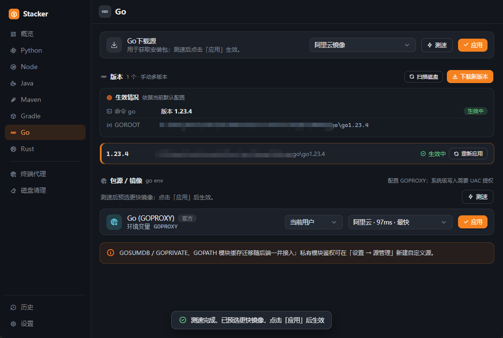
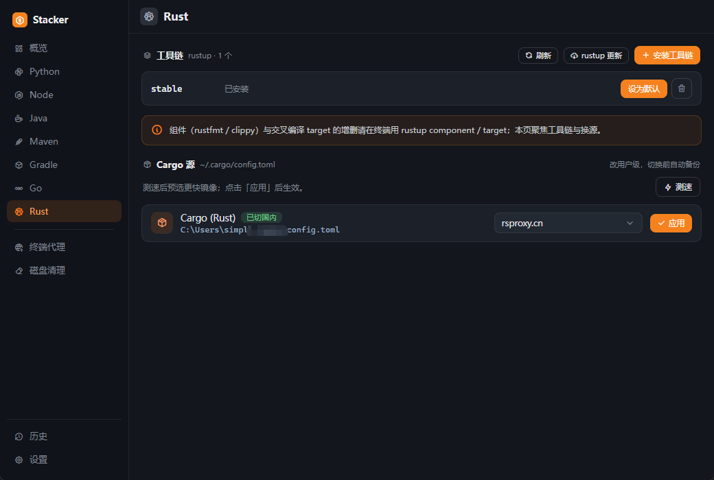
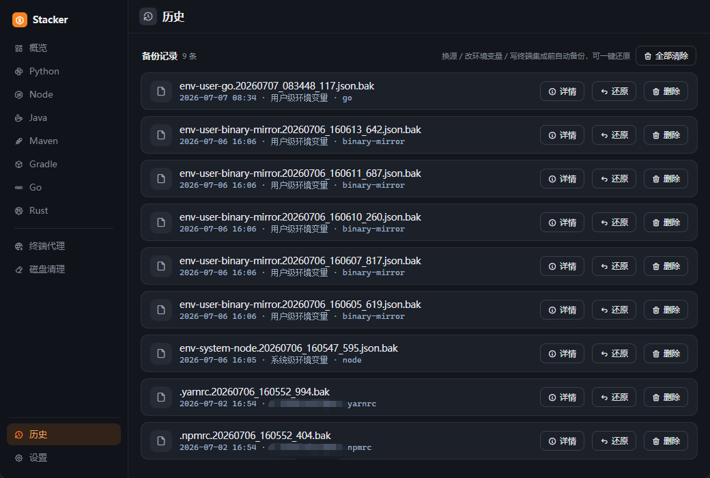
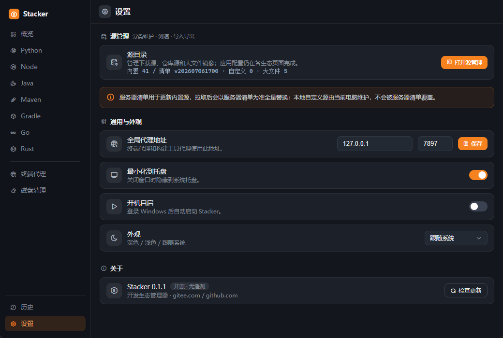

# Stacker

面向 Windows 开发者和 AI 编程新手的开发环境管理器。Stacker 把 Python、Node.js、Java、Maven、Gradle、Go、Rust 的运行时管理、包仓库镜像、终端代理、环境体检和缓存清理集中到一个桌面应用里，让一台新 Windows 机器更快进入可开发状态，也让后续维护有状态、有进度、可回退。

[](https://github.com/byteswalk/stacker/releases)
[](#)
[](LICENSE)
[](https://tauri.app/)


## Summary

Stacker is a Windows desktop app for setting up and maintaining developer environments. It helps manage Python, Node.js, Java, Maven, Gradle, Go and Rust toolchains, configure registries and mirrors, keep terminal proxy settings predictable, and clean common development caches with backup and restore support.

It is designed for Windows developers, beginners using AI coding tools, and teams working behind slow networks, enterprise proxies or private registries.

## 下载

从 [GitHub Releases](https://github.com/byteswalk/stacker/releases/latest) 下载最新版。

- 安装版：适合日常使用，带开始菜单和卸载入口。
- 免安装版：解压后运行 `Stacker.exe`，适合临时测试或放在工具盘。

Stacker 面向 Windows 10 和 Windows 11。首次启动后，建议从“概览”页开始体检，再进入对应语言页面安装运行时、切换默认版本或配置镜像源。

## 它解决什么问题

在 Windows 上，开发环境的问题往往不是“少装了一个工具”这么简单，而是运行时版本、PATH、包仓库、代理、终端集成和缓存状态交织在一起。AI 编程工具会更频繁地产生跨语言项目，新手很容易卡在 `python`、`node`、`java`、`mvn`、`gradle` 命令不可用，或者下载依赖一直失败，却不知道该从哪里排查。

Stacker 的产品思路是“先体检，再处理”：先告诉用户 Python、Node、JDK、包仓库、终端代理和开发缓存哪里有问题，再在对应生态页面完成运行时安装、默认版本切换、镜像配置和清理。耗时操作展示进度，关键写入前自动备份，出了问题可以从历史记录恢复。

它特别适合 Windows 开发者、刚开始使用 AI 编程工具的新手，以及需要在企业代理、私有仓库或受限网络中维护开发环境的团队。

它不会替代 pyenv-win、fnm、rustup、Maven 或 Gradle。它负责把这些工具在 Windows 上装好、接好、配置好，并在出问题时把状态展示清楚。

## 功能

### 开发环境体检

Stacker 会检查常见开发生态的状态，包括 Python、Node、Go、Maven、Gradle、Rust、终端代理和开发缓存。体检结果会直接给出可处理项，例如包源仍在默认源、开发缓存偏高、Windows 临时目录过大等，用户可以从概览页跳转到对应页面处理。

### Python

管理 `pyenv-win`、Python 运行时、pip 镜像和终端集成。支持 Python 下载源测速、版本安装、默认版本设置、pip 用户配置和自选 `pip.ini`。


### Node.js

通过 `fnm` 管理 Node 版本，支持 Node 下载源、默认版本设置、PowerShell / Git Bash / cmd 集成，以及 npm、pnpm、yarn 相关镜像配置。Node 生态的大文件下载镜像也可以单独处理，例如 Electron、Playwright、Cypress、Prisma、sharp 和 HuggingFace。


### Java

扫描本机 JDK，显示 `java` 命令和 `JAVA_HOME` 的真实生效状态。支持默认 JDK 切换、系统级环境变量写入和磁盘扫描，适合同时安装多个 JDK、IDE 自带 JBR 或项目内嵌 JDK 的场景。


### Maven

支持 Maven 版本管理、默认版本设置、仓库镜像配置和代理写入。`settings.xml` 可以使用当前用户配置，也可以手动选择指定文件单独处理。


### Gradle

支持 Gradle 版本管理、默认版本设置、仓库镜像配置和代理写入。`init.gradle` 可以使用当前用户配置，也可以手动选择指定文件单独处理。


### Go

管理 Go SDK 的下载、扫描和默认版本切换，并支持 `GOPROXY` 按当前用户或系统级写入。下载源与包源镜像分开处理：Go 运行时下载用于获取 SDK，包源区域用于配置模块代理。



### Rust

集成 `rustup` 工具链状态、默认工具链切换和 Cargo 镜像配置。Cargo 源支持测速和应用，组件安装仍交给 rustup 原生命令处理，避免和交叉编译 target、组件缓存产生冲突。



### 终端代理

统一维护终端代理地址和 `NO_PROXY` 白名单。开启后写入当前用户环境变量，对新开的终端生效；已经打开的终端可以直接复制页面里的片段命令立即应用。


### 磁盘清理

扫描常见开发缓存和临时目录，区分安全缓存、谨慎项、JetBrains IDE 历史版本和 Windows 临时目录。安全缓存默认勾选，其他项目需要手动确认。临时目录中被占用的文件会自动跳过。


### 历史

Stacker 会对系统做真实修改，所以所有关键写入都尽量保持可见和可回退：

- 写入当前用户环境变量，例如 `PATH`、`JAVA_HOME`、`GOPROXY`、`HTTP_PROXY`。
- 系统级环境变量需要用户确认 UAC 提权。
- 写入工具原生配置，例如 `.npmrc`、`.yarnrc`、`pip.ini`、`settings.xml`、`init.gradle`、Cargo 配置。
- 写入终端集成，例如 PowerShell profile、Git Bash `.bashrc`、cmd AutoRun。
- 重要写入前会保存历史记录，可在“历史”页查看详情、恢复或删除。



### 设置

Stacker 内置常见公共源和镜像源，并支持从 GitHub 拉取公共源清单。源清单使用 `yyyyMMddHHmm` 版本号，应用会在设置页和源管理页检查新版清单，确认后才会替换内置源。本地自定义源保存在当前电脑，不会被公共清单覆盖。

自定义源适合公司内网 Nexus、Artifactory、私有 PyPI、私有 npm registry 或私有 Maven 仓库。需要凭据的源会使用 Windows DPAPI 在本机加密保存。



## 本地数据

Stacker 的用户数据默认保存在当前 Windows 用户目录下：

- `%APPDATA%\stacker\settings.json`
- `%APPDATA%\stacker\profiles.json`
- `%APPDATA%\stacker\custom_sources.json`
- `%APPDATA%\stacker\backups\`
- `%APPDATA%\stacker\mirrors.json`

下载的 fnm、pyenv-win、JDK、Maven、Gradle、Go 等运行时默认放在 Stacker 管理目录下，便于集中迁移和清理。

## 从源码构建

需要 Windows 10 或 Windows 11，并安装以下环境：

- Rust toolchain，最低版本 `1.77.2`
- Node.js 和 npm
- Visual Studio Build Tools 或 MSVC 工具链
- WebView2 Runtime

安装依赖：

```powershell
npm install
```

启动开发版桌面应用：

```powershell
npm run tauri dev
```

构建前端：

```powershell
npm run build
```

打包 Windows 安装版：

```powershell
npm run tauri build
```

## 技术栈

- 桌面框架：Tauri 2
- 前端：React、TypeScript、Vite
- 后端：Rust
- 系统集成：Windows Registry、环境变量、配置文件、DPAPI、UAC 提权

## 许可证

Stacker 使用 [MIT License](LICENSE)。
