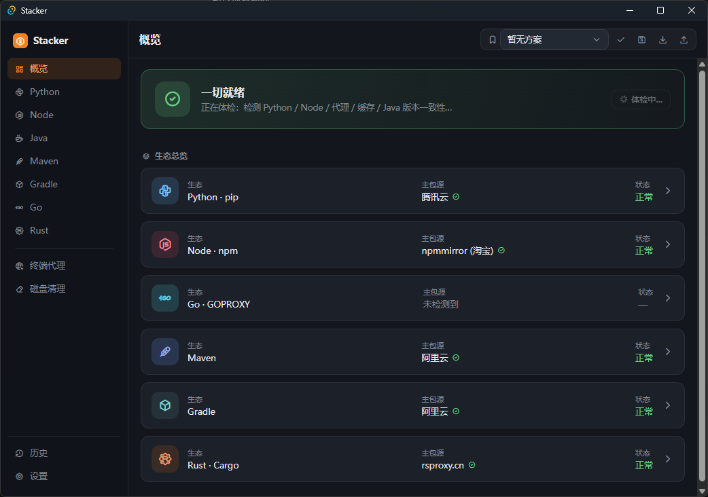
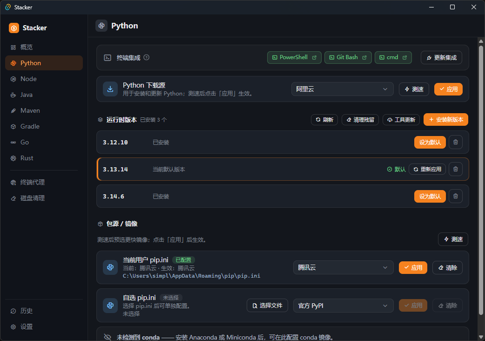
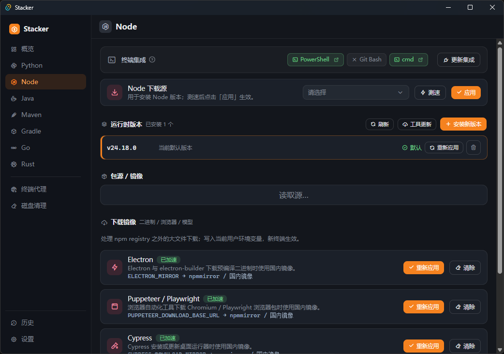
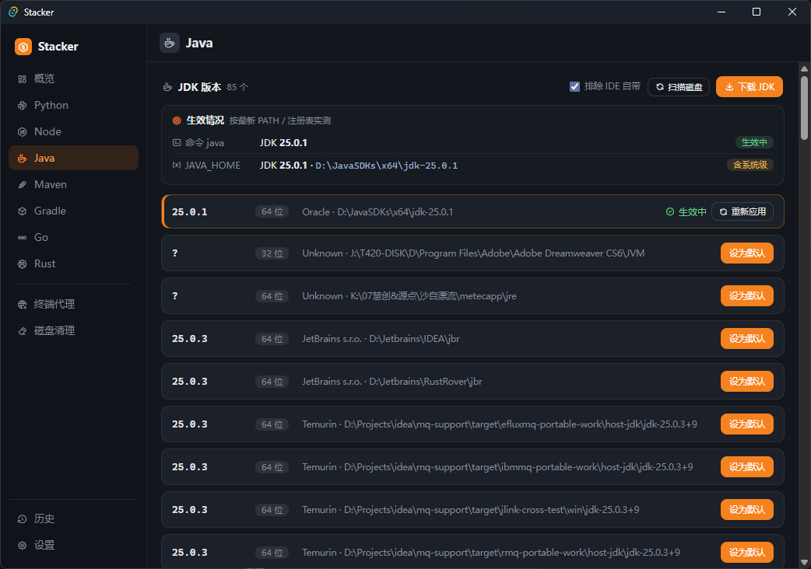
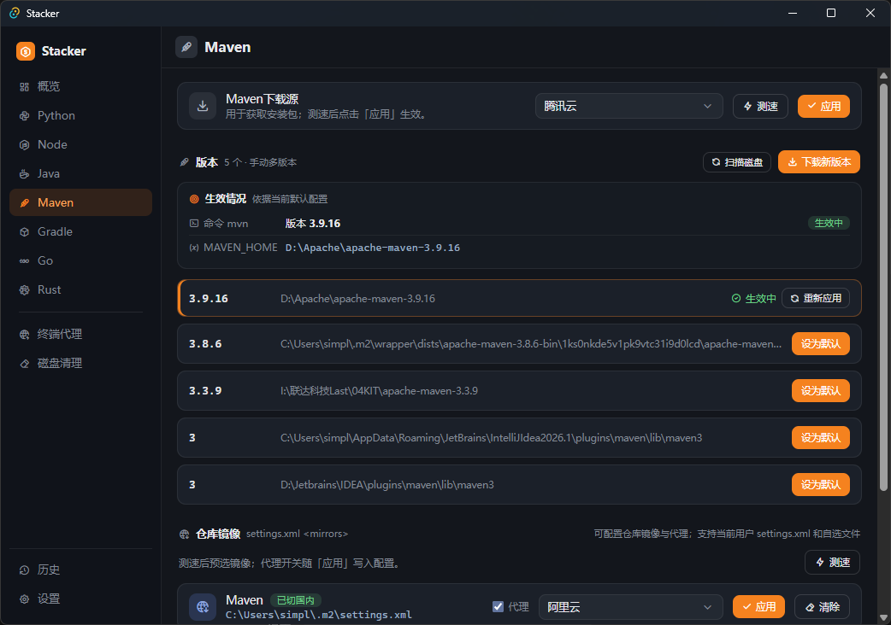
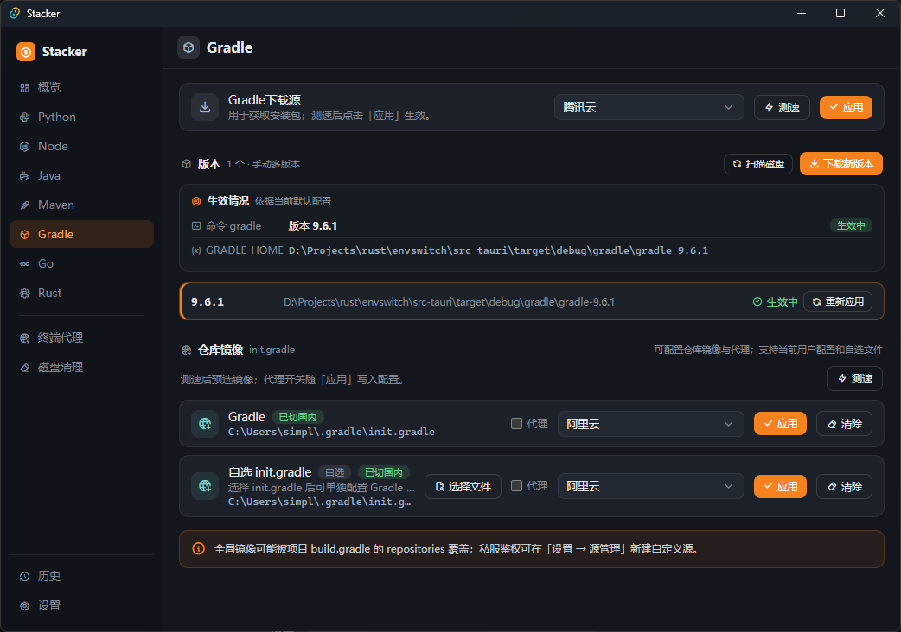
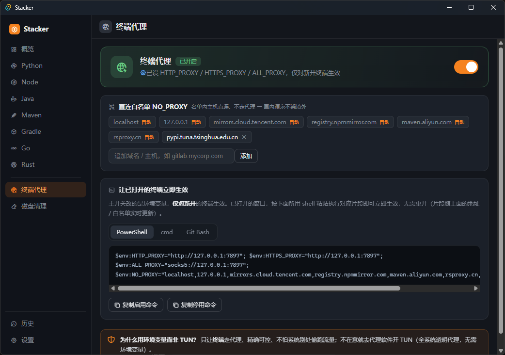
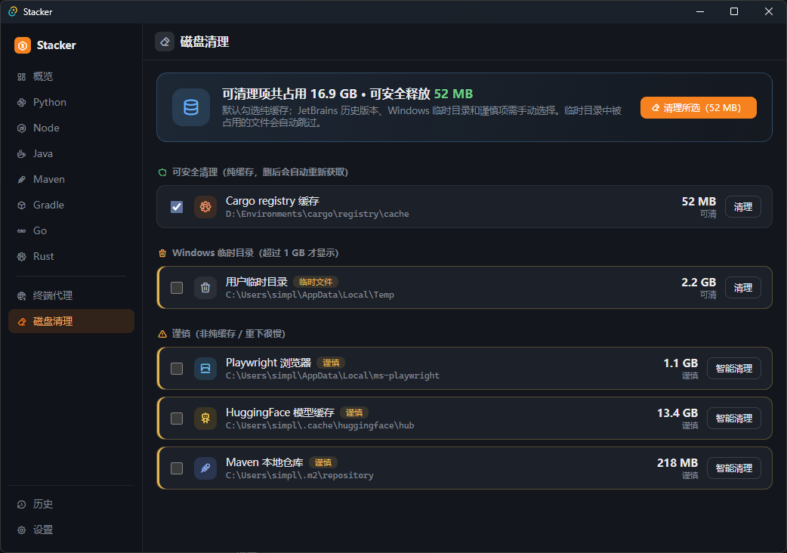

# Stacker

Windows 开发生态管理器。Stacker 把运行时版本、包源镜像、终端代理和开发缓存清理放进一个桌面应用里，适合新机器初始化、国内网络环境配置、多语言工具链维护，以及日常开发环境体检。

[](https://github.com/byteswalk/stacker/releases)
[](#)
[](LICENSE)
[](https://tauri.app/)



## 下载

从 [GitHub Releases](https://github.com/byteswalk/stacker/releases/latest) 下载最新版。

- 安装版：适合日常使用，带开始菜单和卸载入口。
- 免安装版：解压后运行 `Stacker.exe`，适合临时测试或放在工具盘。

Stacker 面向 Windows 10 和 Windows 11。首次启动后，建议从"概览"页开始体检，再进入对应语言页面安装运行时或配置源。

## 它解决什么问题

在 Windows 上准备开发环境经常会遇到几类重复工作：Python 和 Node 版本不好切，包管理器默认源访问慢，Maven 和 Gradle 代理要写配置文件，终端代理只对新窗口生效，历史缓存越堆越大。Stacker 的目标是把这些分散的配置集中起来，用明确的状态、可见的进度和可回退的写入方式处理。

它不会替代 pyenv-win、fnm、rustup、Maven 或 Gradle。它负责把这些工具在 Windows 上装好、接好、配置好，并在出问题时把状态展示清楚。

## 功能

### 开发环境体检

Stacker 会检查常见开发生态的状态，包括 Python、Node、Go、Maven、Gradle、Rust、终端代理和开发缓存。体检结果会给出可操作入口，而不是只展示一段诊断文本。

### Python

管理 `pyenv-win`、Python 运行时、pip 镜像和终端集成。支持 Python 下载源测速、版本安装、默认版本设置、pip 用户配置和自选 `pip.ini`。



### Node.js

通过 `fnm` 管理 Node 版本，支持 Node 下载源、默认版本设置、PowerShell / Git Bash / cmd 集成，以及 npm、pnpm、yarn 相关镜像配置。Node 生态的大文件下载镜像也可以单独处理，例如 Electron、Playwright、Cypress、Prisma、sharp 和 HuggingFace。



### Java

扫描本机 JDK，显示 `java` 命令和 `JAVA_HOME` 的真实生效状态。支持默认 JDK 切换、系统级环境变量写入和磁盘扫描，适合同时安装多个 JDK、IDE 自带 JBR 或项目内嵌 JDK 的场景。



### Maven 和 Gradle

支持 Maven、Gradle 版本管理、默认版本设置、仓库镜像配置和代理写入。Maven `settings.xml`、Gradle `init.gradle` 可以使用当前用户配置，也可以手动选择指定文件单独处理。





### 终端代理

统一维护终端代理地址和 `NO_PROXY` 白名单。开启后写入当前用户环境变量，对新开的终端生效；已经打开的终端可以直接复制页面里的片段命令立即应用。



### 磁盘清理

扫描常见开发缓存和临时目录，区分安全缓存、谨慎项、JetBrains IDE 历史版本和 Windows 临时目录。安全缓存默认勾选，其他项目需要手动确认。临时目录中被占用的文件会自动跳过。



## 源管理

Stacker 内置常见国内外源，并支持从 GitHub 拉取公共源清单。源清单使用 `yyyyMMddHHmm` 版本号，应用会在设置页和源管理页检查新版清单，确认后才会替换内置源。本地自定义源保存在当前电脑，不会被公共清单覆盖。

自定义源适合公司内网 Nexus、Artifactory、私有 PyPI、私有 npm registry 或私有 Maven 仓库。需要凭据的源会使用 Windows DPAPI 在本机加密保存。

## 写入和回退

Stacker 会对系统做真实修改，所以所有关键写入都尽量保持可见和可回退：

- 写入当前用户环境变量，例如 `PATH`、`JAVA_HOME`、`GOPROXY`、`HTTP_PROXY`。
- 系统级环境变量需要用户确认 UAC 提权。
- 写入工具原生配置，例如 `.npmrc`、`.yarnrc`、`pip.ini`、`settings.xml`、`init.gradle`、Cargo 配置。
- 写入终端集成，例如 PowerShell profile、Git Bash `.bashrc`、cmd AutoRun。
- 重要写入前会保存历史记录，可在"历史"页查看和恢复。

## 本地数据

Stacker 的用户数据默认保存在当前 Windows 用户目录下：

- `%APPDATA%\stacker\settings.json`
- `%APPDATA%\stacker\profiles.json`
- `%APPDATA%\stacker\custom_sources.json`
- `%APPDATA%\stacker\backups\`
- `%APPDATA%\stacker\mirrors.json`

下载的 fnm、pyenv-win、JDK、Maven、Gradle、Go 等运行时默认放在 Stacker 管理目录下，便于集中迁移和清理。

## 从源码构建

需要 Windows 10 或 Windows 11，并安装以下环境：

- Rust toolchain，最低版本 `1.77.2`
- Node.js 和 npm
- Visual Studio Build Tools 或 MSVC 工具链
- WebView2 Runtime

安装依赖：

```powershell
npm install
```

启动开发版桌面应用：

```powershell
npm run tauri dev
```

构建前端：

```powershell
npm run build
```

打包 Windows 安装版：

```powershell
npm run tauri build
```

## 技术栈

- 桌面框架：Tauri 2
- 前端：React、TypeScript、Vite
- 后端：Rust
- 系统集成：Windows Registry、环境变量、配置文件、DPAPI、UAC 提权

## 许可证

Stacker 使用 [MIT License](LICENSE)。
