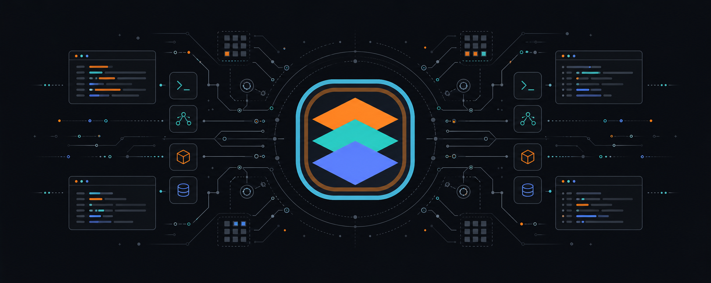
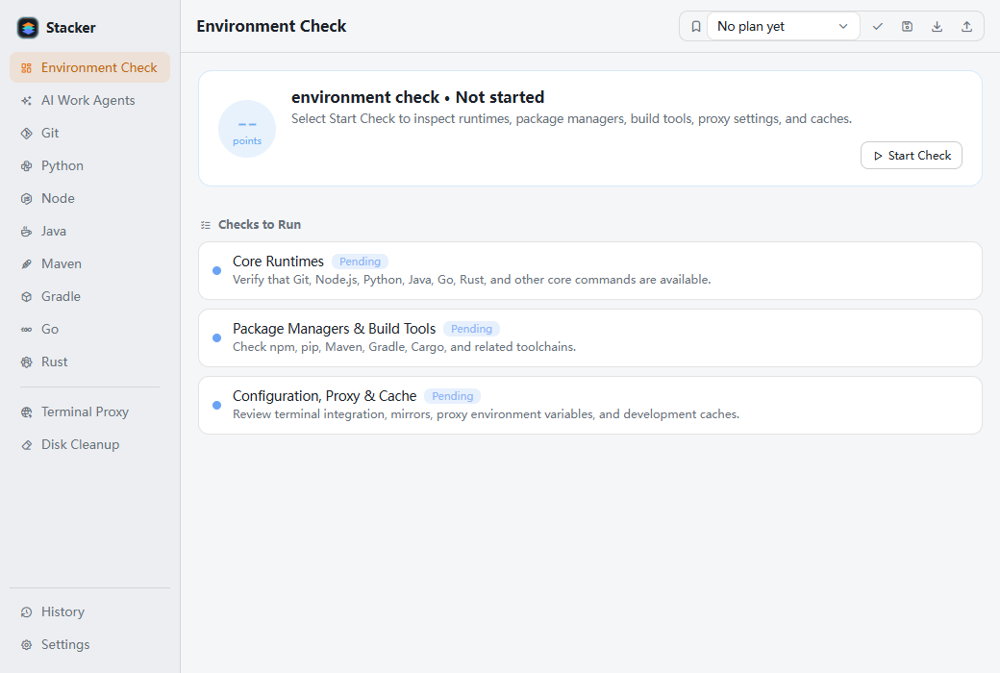
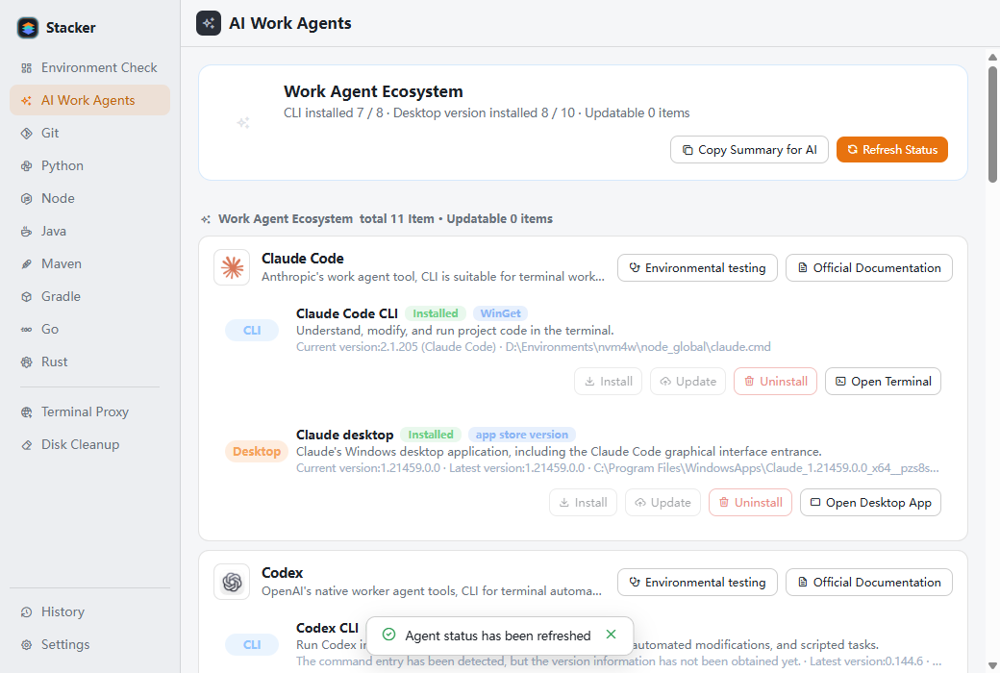
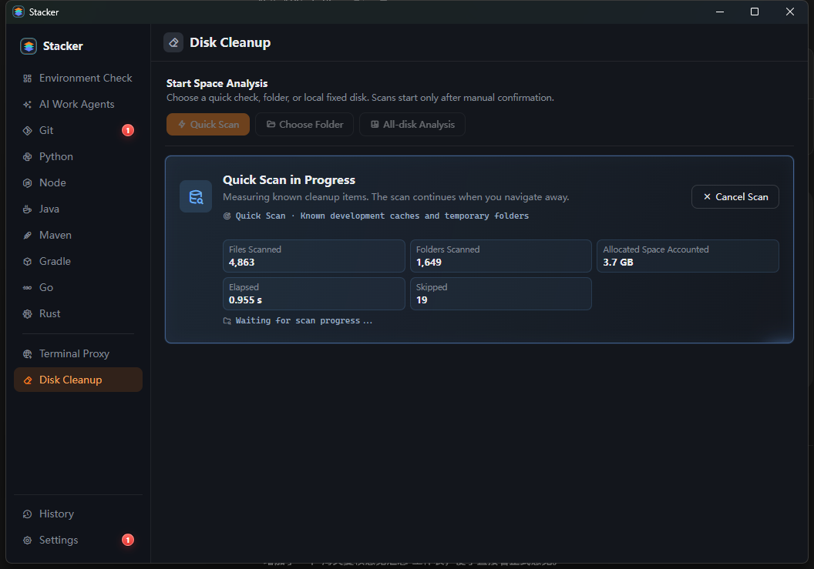

# Stacker

**A local-first Windows developer workstation manager for runtimes, AI coding agents, Git identities, package storage, network sources, and developer disk space.**

Stacker gives Windows developers one control surface for the infrastructure behind modern software work. Inspect the environment that is actually active, manage toolchains and work agents, keep Git accounts isolated, tune download sources, and find the build output and caches consuming local disks.

[Chinese documentation](README.zh-CN.md)

**Get Stacker:** [GitHub Releases](https://github.com/byteswalk/stacker/releases/latest) · [Gitee mirror](https://gitee.com/shaxiong/stacker/releases)

**Platform:** Windows 10/11 · **License:** [MIT](LICENSE) · **Desktop runtime:** [Tauri 2](https://tauri.app/)

## Why Stacker

AI coding tools can edit code and run commands, but they still depend on a healthy local workstation. Multiple projects and agents quickly produce conflicting runtimes, stale PATH entries, duplicated downloads, large browser bundles, package caches, and generated build directories.

Stacker manages that local layer without requiring a model connection or uploading project data:

- **Environment visibility** — verify the effective Git, Python, Node.js, Java, Maven, Gradle, Go, Rust, package-manager, proxy, and cache state.
- **Runtime lifecycle** — discover, install, switch, verify, and remove local toolchain versions.
- **Agent management** — inspect supported CLI and desktop products, distinguish regional editions, verify that installs actually run, and install, update, uninstall or repair them as parallel background tasks with one-click update.
- **Local conversation workspace** — index supported Codex and Claude records, search and group conversations, export readable archives and handoff notes, and perform guarded native operations where the installed client exposes a verified interface.
- **Git account isolation** — use separate terminal contexts and repository-level commit identities for GitHub, Gitee, GitLab, Gitea, Forgejo, Codeup, enterprise, and generic HTTPS Git services.
- **Source and network control** — test latency, select download and repository sources, manage terminal proxy settings, and preserve local custom sources.
- **Package storage placement** — move or reset Maven, Gradle, npm, pnpm, pip, Composer, Go, Cargo, and rustup download or build stores without deleting the old location automatically.
- **Developer disk intelligence** — scan selected folders or disks, recognize development projects and agent traces, locate large files, review rebuildable artifacts by project, and remove only classified targets after confirmation.
- **Recoverable changes** — back up supported configuration before writing and restore it from local history.

## Product Tour

### Programming Ecosystem Check

Run an on-demand check of the commands, runtimes, package managers, build tools, proxy configuration, and developer caches that are actually effective on the workstation.



### Agent Install & Update

Review supported AI coding-agent CLI and desktop installations from one page. The catalog currently covers Claude Code, Codex, Antigravity, OpenCode, ZCode, Kimi, WorkBuddy regional editions, Qoder regional editions, TRAE regional editions, DeepSeek Harness, OpenClaw, Hermes Agent, and pi. Broken installs, such as placeholders left by a failed install, are flagged and can be repaired when a healthy install exists. Updates can be queued in one click and run in the background. Availability and automated lifecycle actions vary by vendor surface.



### Conversation And Project Workspace

Build a local index of supported Codex and Claude records without copying the full transcript into the database. Filter, search, group, export, summarize with an explicitly configured compatible endpoint, and review the project paths associated with each conversation. Source-changing operations are capability-gated, previewed, and backed up before execution.

### Git Account Environments

Keep multiple Git service accounts available without changing a machine-wide default identity. Access tokens remain in Windows Credential Manager and are never included in summaries copied for AI.

### Developer Disk Analysis

Quick Scan checks known developer caches. Deep analysis accepts multiple folders or fixed disks, continues in the background, reports live progress, and supports directory drill-down and Explorer access. Project analysis recognizes common stacks, agent traces, dependencies, build output, and dedicated agent build directories. Cleanup is available only for classified **Development Artifacts** and **Caches & Downloads**; every run requires confirmation and revalidates its targets.



## Supported Ecosystems

| Ecosystem | Capabilities |
| --- | --- |
| Git | Git for Windows detection and updates, isolated account terminals, project initialization, repository migration |
| Python | pyenv-win, runtime discovery and installation, default version, pip sources, terminal integration |
| PHP | PHP for Windows discovery and installation, default runtime, Composer lifecycle and sources |
| Node.js | fnm, runtime discovery and installation, npm/pnpm/yarn sources, large-download mirrors |
| Java | JDK discovery and installation, user or system `JAVA_HOME` and `PATH` |
| Maven | Version discovery, installation, repository mirrors, proxy configuration, `settings.xml` |
| Gradle | Version discovery, Wrapper download sources, repository mirrors, initialization scripts |
| Go | SDK discovery and installation, user or system `GOROOT` and `GOPROXY` |
| Rust | rustup toolchains, channels and pinned versions, components, targets, Cargo sources |

Storage-location controls are available where the ecosystem provides a stable user-level setting. Existing data can be copied to an empty destination, but Stacker deliberately preserves the old directory until the user verifies the new location.

## Security and Privacy

- Project files, machine summaries, and Git access tokens are not uploaded by Stacker.
- Conversation indexing stays local. Summaries leave the machine only after the configured destination and payload preview are approved.
- Git tokens are stored through Windows Credential Manager.
- System-level environment changes and protected-directory scans require explicit Windows UAC approval.
- Uncertain disk items remain view-only; cleanup is limited to classified targets and requires confirmation.
- Supported configuration changes create local backups before writing.
- Release assets include SHA-256 checksums.

## Code Signing Policy

See the project [code signing policy](CODE_SIGNING.md) for the signing scope, build and approval process, project roles, privacy behavior, and release verification guidance.

Planned signing service (application pending): Free code signing provided by [SignPath.io](https://about.signpath.io/), certificate by [SignPath Foundation](https://signpath.org/). Stacker `v0.3.2` and earlier releases are currently unsigned.

## Download

Download the latest build from [GitHub Releases](https://github.com/byteswalk/stacker/releases/latest). If GitHub is slow or unavailable on your network, use the [Gitee release mirror](https://gitee.com/shaxiong/stacker/releases).

- **Installer** for regular desktop use.
- **Portable package** for temporary or removable-tool use.
- **`SHA256SUMS.txt`** for artifact verification.

## Requirements

- Windows 10 or Windows 11, 64-bit.
- Microsoft Edge WebView2 Runtime, included with most current Windows installations.
- Administrator approval only for operations that explicitly modify system-level state or scan protected paths.

## Build from Source

Install Node.js, Rust stable, MSVC Build Tools, and the WebView2 development runtime.

```powershell
npm ci
npm run tauri dev
```

Run project checks:

```powershell
npm run lint
npm run typecheck
npm run test
cargo test --manifest-path src-tauri/Cargo.toml
cargo clippy --manifest-path src-tauri/Cargo.toml --all-targets -- -D warnings
```

Build the Windows installer, portable package, and checksum file:

```powershell
npm run release:windows
```

## Project Documentation

- [Conversation workspace behavior and safety boundaries](docs/conversations.md)
- [Development, verification, cleanup, and maintainer handoff](docs/development.md)

## License

Stacker is available under the [MIT License](LICENSE).
