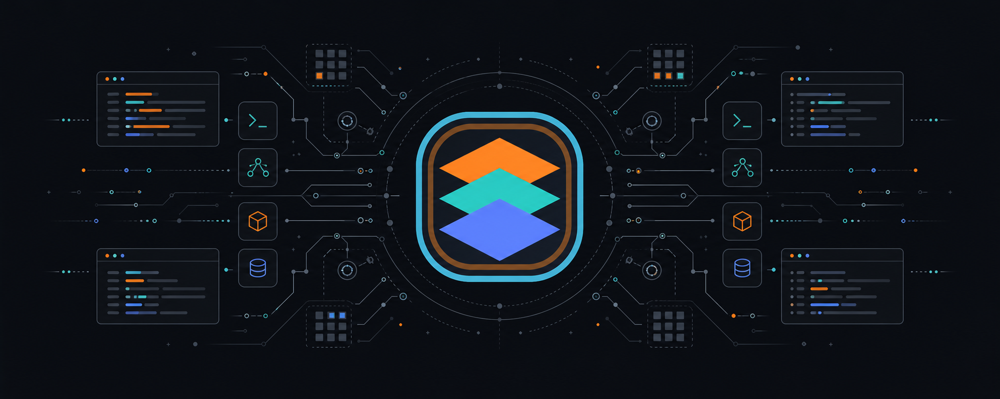
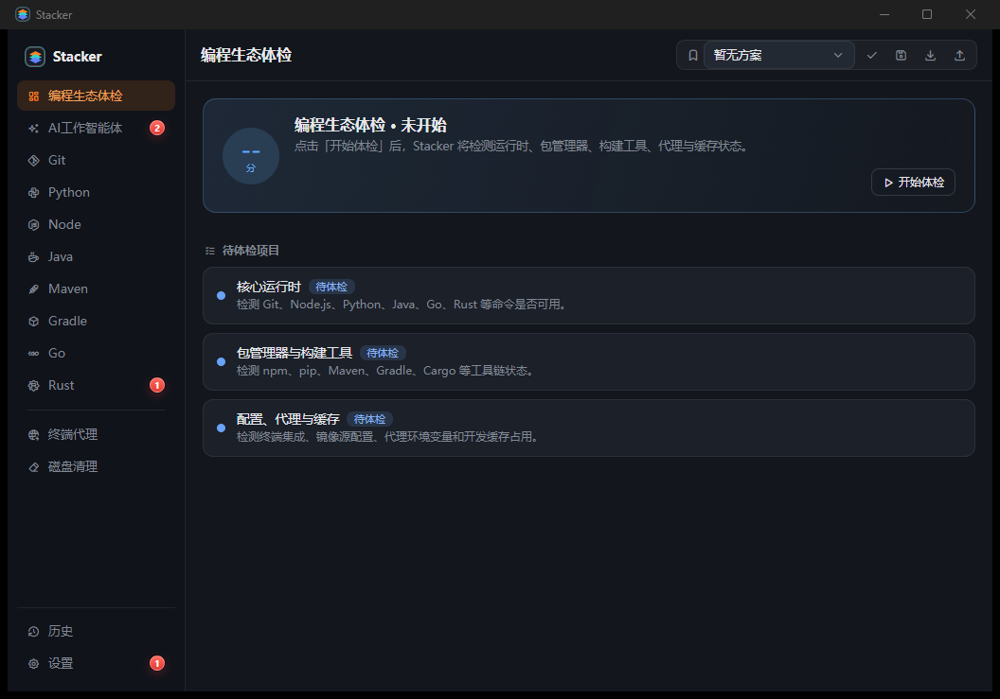
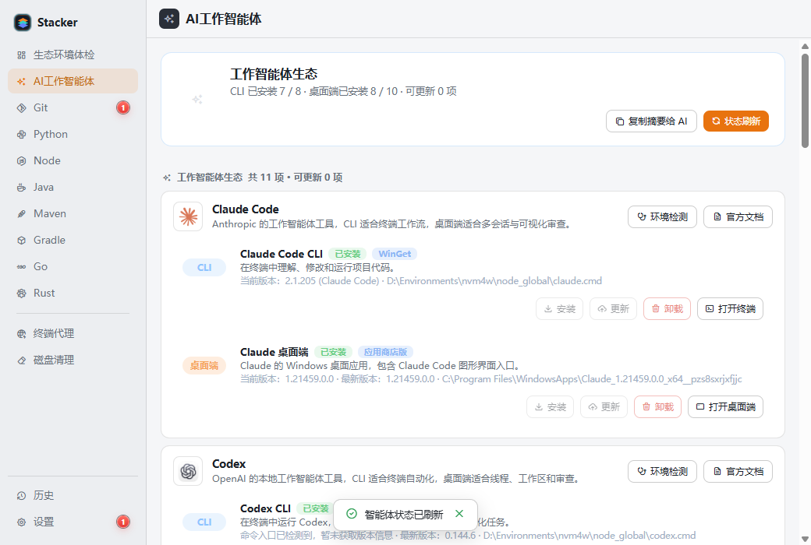
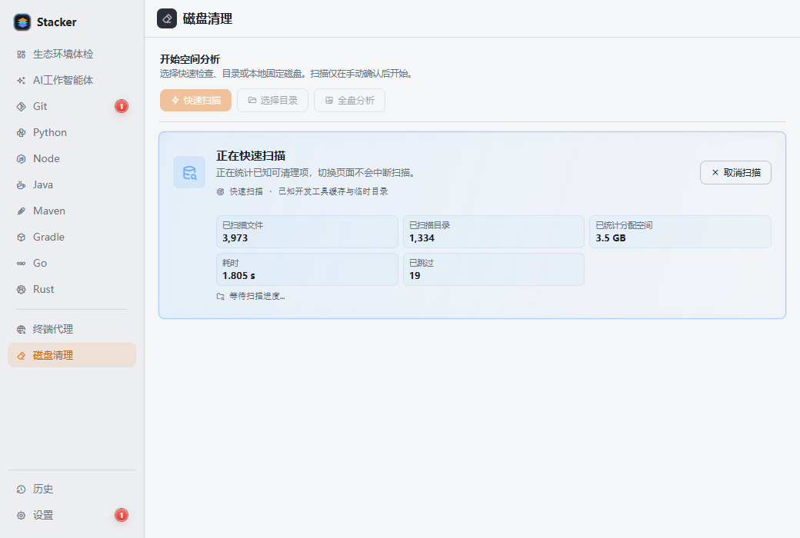

# Stacker

**面向 Windows 开发者的本地工作站管理器，统一管理运行时、AI 工作智能体、Git 身份、网络源和开发磁盘空间。**

Stacker 把现代软件开发依赖的本机基础设施集中到一个控制界面：查看真正生效的环境，管理工具链和工作智能体，隔离多个 Git 账号，优化下载连接，并找出占满磁盘的构建产物与缓存。

[English](README.md)

## 代码签名策略

代码签名的适用范围、构建与审批流程、项目角色、隐私行为和版本校验方式见 [Code signing policy](CODE_SIGNING.md)。

计划使用的签名服务（申请审核中）：Free code signing provided by [SignPath.io](https://about.signpath.io/), certificate by [SignPath Foundation](https://signpath.org/)。Stacker `v0.3.2` 及更早版本目前尚未签名。

**下载 Stacker：** [Gitee 发行版](https://gitee.com/shaxiong/stacker/releases) · [GitHub 备用下载](https://github.com/byteswalk/stacker/releases/latest)

**支持系统：** Windows 10/11 · **开源许可：** [MIT](LICENSE) · **桌面框架：** [Tauri 2](https://tauri.app/)

## 为什么需要 Stacker

AI 编程工具可以修改代码和执行命令，但仍然依赖健康、可预测的本机环境。项目和智能体增多后，运行时冲突、失效 PATH、重复下载、浏览器组件、包缓存和构建目录会逐渐演变成工作站问题。

Stacker 管理的正是这一层，并且不要求接入大模型，也不会上传项目内容：

- **环境可见**：检查 Git、Python、Node.js、Java、Maven、Gradle、Go、Rust、包管理器、代理和缓存的实际生效状态。
- **运行时管理**：发现、安装、切换、验证和删除本机工具链版本。
- **AI 工作智能体管理**：集中查看支持的 CLI 与桌面端，单独刷新某个智能体，并复制已安装智能体摘要供 AI 使用。
- **Git 多账号隔离**：为 GitHub、Gitee、GitLab、Gitea、Forgejo、Codeup、企业和通用 HTTPS Git 服务提供独立终端上下文与仓库级提交身份。
- **下载与网络管理**：测速并选择下载源和仓库源，管理终端代理，保留本机自定义源。
- **开发磁盘分析**：扫描指定目录或磁盘，下钻查看占用，定位大文件，按路径筛选清理项，并在确认后删除已分类的可重建内容。
- **配置可恢复**：支持的配置写入前自动备份，可从本地历史中恢复。

## 功能预览

### 编程生态体检

按需检查当前工作站真正生效的命令、运行时、包管理器、构建工具、代理设置和开发缓存。



### AI 工作智能体

集中查看受支持的 AI 编程与工作智能体 CLI、桌面端安装状态。检测和生命周期操作只刷新当前智能体，不阻塞其他功能。



### Git 账号执行环境

同时保留多个 Git 服务账号，不修改整台机器的默认身份。访问令牌保存在 Windows 凭据管理器中，不会写入工程，也不会出现在复制给 AI 的摘要中。

### 开发磁盘分析

快速扫描用于检查已知开发缓存；深度分析支持选择多个目录或固定磁盘，在后台持续执行并显示实时进度。结果支持目录下钻、资源管理器打开和路径关键字筛选。清理入口仅在“开发产物”和“缓存与下载”分类开放，每次执行都需要确认并重新校验目标。



## 支持的开发生态

| 生态 | 管理能力 |
| --- | --- |
| Git | Git for Windows 检测与更新、账号隔离终端、工程初始化、仓库迁移 |
| Python | pyenv-win、运行时发现与安装、默认版本、pip 源、终端集成 |
| Node.js | fnm、运行时发现与安装、npm/pnpm/yarn 源、大文件下载镜像 |
| Java | JDK 发现与安装、用户级或系统级 `JAVA_HOME` 与 `PATH` |
| Maven | 版本发现与安装、仓库镜像、代理配置、`settings.xml` |
| Gradle | 版本发现与安装、Wrapper 下载源、仓库镜像、初始化脚本 |
| Go | SDK 发现与安装、用户级或系统级 `GOROOT` 与 `GOPROXY` |
| Rust | rustup 工具链、通道与固定版本、组件、targets、Cargo 源 |

## 安全与隐私

- Stacker 不上传项目文件、本机摘要或 Git 访问令牌。
- Git 令牌通过 Windows 凭据管理器保存。
- 系统级环境修改和受保护目录扫描需要明确的 Windows UAC 授权。
- 无法确认的磁盘内容只展示；清理仅处理已分类目标，并要求用户确认。
- 支持的配置修改会在写入前创建本地备份。
- Release 产物提供 SHA-256 校验文件。

## 下载

国内网络建议从 [Gitee 发行版](https://gitee.com/shaxiong/stacker/releases) 下载；也可以使用 [GitHub Releases](https://github.com/byteswalk/stacker/releases/latest) 备用入口。

- **安装版**：适合日常桌面使用。
- **免安装版**：适合临时使用或便携工具盘。
- **`SHA256SUMS.txt`**：用于校验发布文件。

## 系统要求

- Windows 10 或 Windows 11，64 位。
- Microsoft Edge WebView2 Runtime，当前 Windows 通常已预装。
- 只有明确修改系统级状态或扫描受保护路径时才需要管理员授权。

## 从源码构建

准备 Node.js、Rust stable、MSVC Build Tools 和 WebView2 开发环境。

```powershell
npm install
npm run tauri dev
```

执行项目检查：

```powershell
npm run lint
npm run typecheck
npm run test
cargo test --manifest-path src-tauri/Cargo.toml
cargo clippy --manifest-path src-tauri/Cargo.toml --all-targets -- -D warnings
```

生成 Windows 安装版、免安装版和校验文件：

```powershell
npm run release:windows
```

## 许可证

Stacker 使用 [MIT License](LICENSE) 开源。
