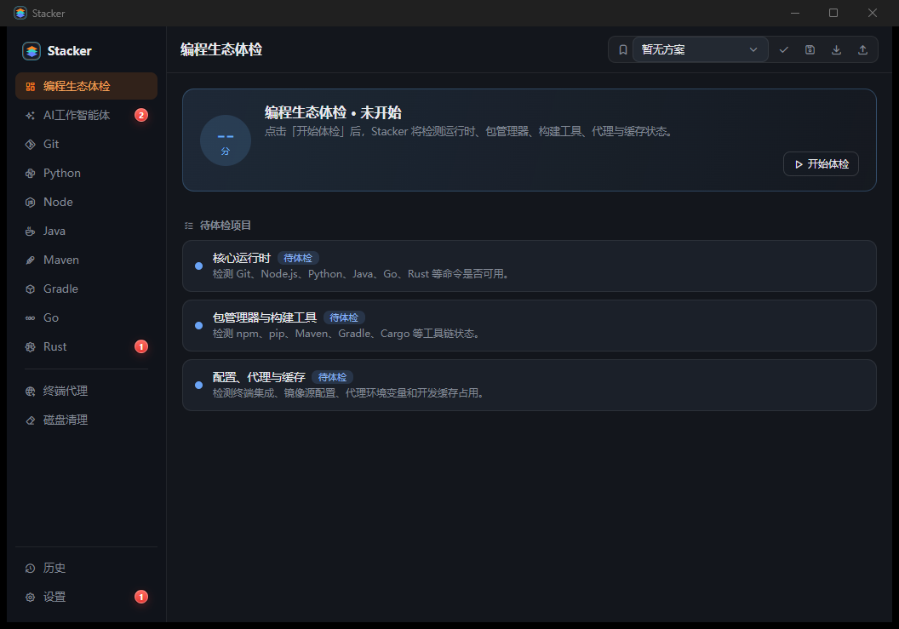
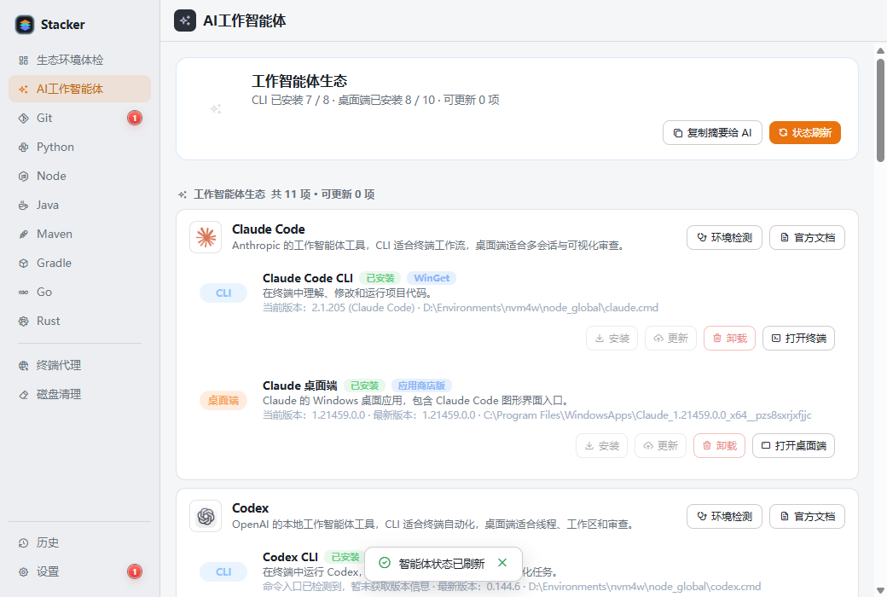
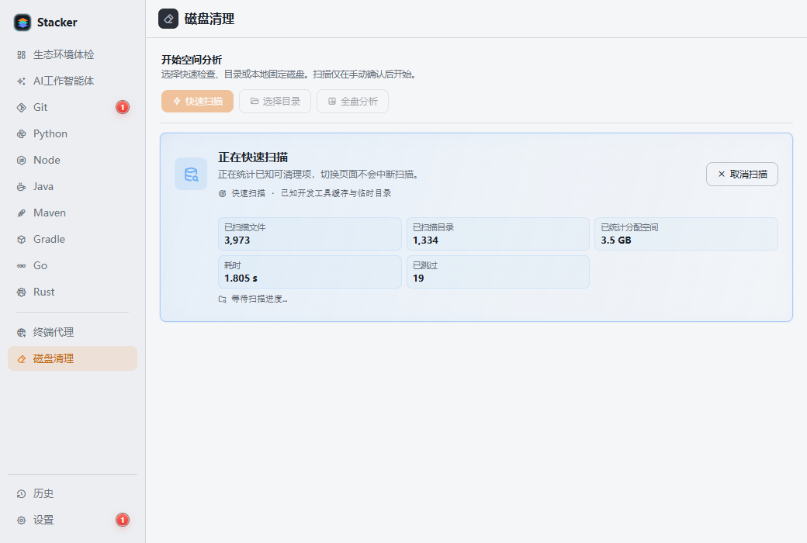

# Stacker

**面向 Windows 开发者的本地工作站管理器，统一管理运行时、AI 编程智能体、Git 身份、依赖存储、网络源和开发磁盘空间。**

Stacker 把现代软件开发依赖的本机基础设施集中到一个控制界面：查看真正生效的环境，管理工具链和工作智能体，隔离多个 Git 账号，优化下载连接，并找出占满磁盘的构建产物与缓存。

[English](README.md)

## 代码签名策略

代码签名的适用范围、构建与审批流程、项目角色、隐私行为和版本校验方式见 [Code signing policy](CODE_SIGNING.md)。

计划使用的签名服务（申请审核中）：Free code signing provided by [SignPath.io](https://about.signpath.io/), certificate by [SignPath Foundation](https://signpath.org/)。Stacker `v0.3.2` 及更早版本目前尚未签名。

**下载 Stacker：** [Gitee 发行版](https://gitee.com/shaxiong/stacker/releases) · [GitHub 备用下载](https://github.com/byteswalk/stacker/releases/latest)

**支持系统：** Windows 10/11 · **开源许可：** [MIT](LICENSE) · **桌面框架：** [Tauri 2](https://tauri.app/)

## 为什么需要 Stacker

AI 编程工具可以修改代码和执行命令，但仍然依赖健康、可预测的本机环境。项目和智能体增多后，运行时冲突、失效 PATH、重复下载、浏览器组件、包缓存和构建目录会逐渐演变成工作站问题。

Stacker 管理的正是这一层，并且不要求接入大模型，也不会上传项目内容：

- **环境可见**：检查 Git、Python、Node.js、Java、Maven、Gradle、Go、Rust、包管理器、代理和缓存的实际生效状态。
- **运行时管理**：发现、安装、切换、验证和删除本机工具链版本。
- **智能体管理**：集中查看支持的 CLI 与桌面产品，区分国内版和国际版，检查安装是否真正可用；安装、更新、卸载和修复在后台并行执行，支持一键更新并在完成时提示。
- **智能体会话数据**：按客户端里的样子列出 Codex、Claude、CodeBuddy、WorkBuddy、Qoder、Kimi、MiMo Code 及各桌面端的会话，按项目归类，生成摘要或项目交接，迁移到另一台电脑，统计并迁移各智能体的数据目录，并在精简导出后批量删除。
- **接口服务**：把已登录的智能体 CLI（Codex、Claude、CodeBuddy、Qoder、Kimi Code、MiMo Code、Antigravity）以 OpenAI / Anthropic 风格接口提供给你自己的工具；默认仅本机，可选开放局域网，每个请求都要密钥，请求记录不保存内容。
- **密钥保管**：在本机加密保管库中保存 API 密钥、令牌、SSH 密钥和网站登录信息，带恢复密钥；浏览器插件可以提示保存并一键填充网站密码。
- **Stacker AI**：全应用共用一个 AI 来源；能用上第二意见的页面可以用它诊断、解释或搜索，只发送你问到的内容。
- **Git 多账号隔离**：为 GitHub、Gitee、GitLab、Gitea、Forgejo、Codeup、企业和通用 HTTPS Git 服务提供独立终端上下文与仓库级提交身份。
- **下载与网络管理**：测速并选择下载源和仓库源，保留本机自定义源；代理总览显示终端、Git、npm、Yarn、Maven、Gradle 的代理来源，默认「不干预」，只同步 Stacker 自己写入的条目。
- **依赖与缓存位置管理**：调整或恢复 Maven、Gradle、npm、pnpm、pip、Composer、Go、Cargo 和 rustup 的下载、依赖或构建存储位置。
- **开发磁盘分析**：扫描指定目录或磁盘并以占用图展示，识别开发项目、智能体痕迹和可重建产物，查找大文件和重复文件，压缩大文件（NTFS 透明压缩、H.265 视频、JPEG/WebP/AVIF 图片），按项目核对空间占用，确认后删除已分类目标并保留清理记录。
- **配置可恢复**：支持的配置写入前自动备份，可从本地历史中恢复。

## 功能预览

### 编程生态体检

按需检查当前工作站真正生效的命令、运行时、包管理器、构建工具、代理设置和开发缓存。



### 智能体安装更新

集中查看受支持的 AI 编程智能体 CLI、桌面端安装状态。当前目录覆盖 Claude Code、Codex、Antigravity、Grok Build、OpenCode、ZCode、Kimi、CodeBuddy、WorkBuddy、Qoder、TRAE、DeepSeek Harness、OpenClaw、Hermes Agent、pi、GitHub Copilot、Cursor、Factory、Kiro、MiniMax Code、小米 MiMo 和 Agnes Code，厂商同时提供国内版和国际版时分开列出。安装、更新、卸载和修复都作为后台任务执行，并在任务中心查看；CLI 只有真正能运行才算健康，安装损坏时可按它自己报错里给出的命令修复。不同厂商产品形态支持的自动化程度不同，少数厂商安装器需要在它自己的窗口中点击，或需要 UAC 授权。



### 会话数据

直接读取各智能体自己的记录：Codex 状态数据库、Claude 桌面端会话索引，以及 CodeBuddy、WorkBuddy、Qoder、Kimi Code、MiMo Code 和各桌面端的会话存储，标题、归档状态和项目与客户端一致。子智能体运行归入父会话，自动化运行默认隐藏；已在 Claude 桌面端删除但文件仍在的会话标为孤儿。会话可以用本机智能体生成摘要或项目交接，可以迁移到另一台电脑，也可以导出；「占用」页统计每个智能体的数据目录，并可迁移到其他磁盘。批量删除先预览、执行前再次核对，默认先把每个会话精简导出为 Markdown；Codex 会话通过 Codex App Server 删除，仍在 Claude 桌面端侧栏中的会话不会被删除。

### 接口服务

把你已经登录的智能体 CLI 以 OpenAI / Anthropic 风格接口提供给自己的工具。每个请求都在临时空目录中无状态运行，不开放任何工具；请求必须带页面上显示的密钥，来自网页的请求一律拒绝。默认只监听本机，打开局域网访问后才对局域网开放。详见 [接口服务说明](docs/gateway.md)。

### Git 账号执行环境

同时保留多个 Git 服务账号，不修改整台机器的默认身份。访问令牌保存在 Windows 凭据管理器中，不会写入工程，也不会出现在复制给 AI 的摘要中。

### 开发磁盘分析

快速扫描用于检查已知开发缓存；深度分析支持选择多个目录或固定磁盘，在后台持续执行并显示实时进度。结果以占用图展示，支持目录下钻、资源管理器打开和路径关键字筛选，并可按项目查看技术栈、智能体痕迹、依赖目录、构建产物和智能体专用构建目录。大文件和重复文件可以核对后删除；大文件还可以压缩：NTFS 透明压缩，或把视频转为 H.265、把图片转为 JPEG/WebP/AVIF，分辨率可选。清理入口仅在“开发产物”和“缓存与下载”分类开放，每次执行都需要确认并重新校验目标，并记入清理记录。



## 支持的开发生态

| 生态 | 管理能力 |
| --- | --- |
| Git | Git for Windows 检测与更新、账号隔离终端、工程初始化、仓库迁移 |
| Python | pyenv-win、运行时发现与安装、默认版本、pip 源、终端集成 |
| PHP | PHP for Windows 发现与安装、默认运行时、Composer 生命周期与软件源 |
| Node.js | fnm、运行时发现与安装、npm/pnpm/yarn 源、大文件下载镜像 |
| Java | JDK 发现与安装、用户级或系统级 `JAVA_HOME` 与 `PATH` |
| Maven | 版本发现与安装、仓库镜像、代理配置、`settings.xml` |
| Gradle | 版本发现与安装、Wrapper 下载源、仓库镜像、初始化脚本 |
| Go | SDK 发现与安装、用户级或系统级 `GOROOT` 与 `GOPROXY` |
| Rust | rustup 工具链、通道与固定版本、组件、targets、Cargo 源 |

只有生态本身提供稳定用户级设置时，Stacker 才开放存储位置管理。迁移可将现有内容复制到空目录，但旧目录会保留，待用户确认新位置可用后自行清理。

## 安全与隐私

- Stacker 不上传项目文件、本机摘要或 Git 访问令牌。AI 功能只发送你问到的内容，并且只发给你选择的 AI 来源或本机智能体。
- 会话数据在本机读取；只有你要求生成摘要、交接或提炼时，才会交给模型处理。
- Git 令牌通过 Windows 凭据管理器保存。密钥保管库用 Argon2id 与 XChaCha20-Poly1305 加密条目；Stacker 从不读取智能体的登录凭据。
- 接口服务默认只监听本机，每个请求都要密钥，不保存请求和回复内容。
- 系统级环境修改和受保护目录扫描需要明确的 Windows UAC 授权。
- 无法确认的磁盘内容只展示；清理仅处理已分类目标，并要求用户确认。
- 支持的配置修改会在写入前创建本地备份。
- Release 产物提供 SHA-256 校验文件。

## 下载

国内网络建议从 [Gitee 发行版](https://gitee.com/shaxiong/stacker/releases) 下载；也可以使用 [GitHub Releases](https://github.com/byteswalk/stacker/releases/latest) 备用入口。

- **安装版**：适合日常桌面使用。
- **免安装版**：适合临时使用或便携工具盘。
- **`SHA256SUMS.txt`**：用于校验发布文件。

## 系统要求

- Windows 10 或 Windows 11，64 位。
- Microsoft Edge WebView2 Runtime，当前 Windows 通常已预装。
- 只有明确修改系统级状态或扫描受保护路径时才需要管理员授权。

## 从源码构建

准备 Node.js、Rust stable、MSVC Build Tools 和 WebView2 开发环境。

```powershell
npm ci
npm run tauri dev
```

执行项目检查：

```powershell
npm run lint
npm run typecheck
npm run test
cargo test --manifest-path src-tauri/Cargo.toml
cargo clippy --manifest-path src-tauri/Cargo.toml --all-targets -- -D warnings
```

生成 Windows 安装版、免安装版和校验文件：

```powershell
npm run release:windows
```

## 网页对话浏览器插件

一个 Chromium 内核浏览器插件（Chrome、Edge 等），独立于桌面客户端运行，用于整理、搜索、导出和清理 ChatGPT、Claude、Gemini、Grok、DeepSeek 网页版对话，数据只存在本机。安装与使用说明见 [插件说明](extension/README.md)。

## 项目文档

- [会话数据的行为和安全边界](docs/sessions.md)
- [接口服务（本机网关）](docs/gateway.md)
- [开发、验证、清理与维护交接](docs/development.md)

## 许可证

Stacker 使用 [MIT License](LICENSE) 开源。
